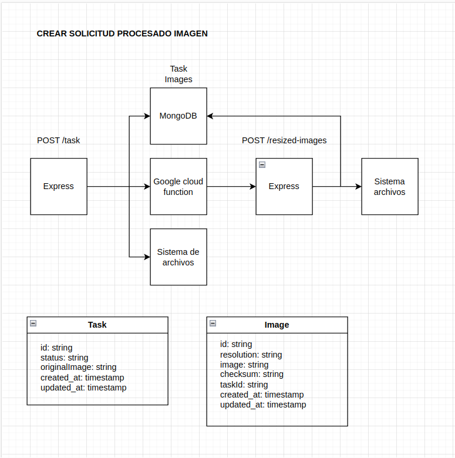

# Image Resize API REST
## Introduction
This service generates variants of the uploaded image in different resolutions to serve them to different clients (web, mobile applications).

## Overview Diagram


## Installation
**Note: First of all, read functions README to configure GCF**

You should install npm's dependencies
```bash 
npm i
```
Then you can run the project
```bash
npm start
```

## Local development
You can launch the project to develop using **nodemon**. 

Launch the project with hot reload for development using the command below:
```bash
npm run dev
```

## API REST Documentation
For more info about the API [click here](api/swagger/openapi.yaml)